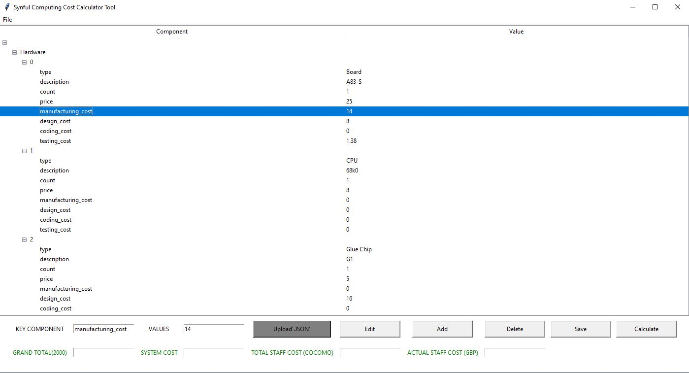

# Introducing "Synful Computing Cost Estimation Tool"

*A cost estimating application  using industry standard JSON data.
(University of Essex - September 2023 (SEPM) Assignment Part 2*
___
### Features 
1. CLI and GUI based application
2. Import, Edit, Add, & Export Json data
3. COCOMO Cost Estimation Algorithm
___
##  Installation & Usage 
1. Download and unzip the application in the preferred location from here.
 

**Option A:** To use the application through CLI based operations, type the following file name on the terminal:
~~~
user_interface.py
~~~
To navigate through the application, type a command from the command options presented in the terminal. 
Please follow the steps below to navigate the application successfully.
1. Load the json file to the application **(ld)**
2. Preview the JSON data into the terminal window in table format **(pd)**
3. Perform calculation on the JSON data **(clc)**
 
___

**Option B:** To use the application through a GUI, type the following file name on the terminal:
~~~
gui.py
~~~
This is a "Tkinter" based GUI with the following functions:
1. Loads JSON file into the system using the upload button. 
2. Can create and save new data into JSON typing in the component and value field inputs and clicking 
the **Add** or **New** buttons.
3. Can edit, delete and save data selected in the table / tree viewer. 

*Important Notes*
+ The JSON Data that is uploaded will be previewed in the Tkinter's table/tree viewer.
+ The data in the table can be navigated through clicking on the desired data row. 
+ The JSON data consists of nested lists and dictionaries, make sure to click on the (+) sign to preview 
nested keys and values.
+ By clicking on **New** from the file menu, The data will be erased from the table. 

A preview of the GUI can be seen below:

___

##  Application Manual.   
**<u>File Structure</u>**
+ assets : Directory for supplementary screenshots.
+ data : Directory  for JSON data.
+ cocomo.py: Calculation Algorithm.
+ gui.py: GUI interface and functions.
+ user_interface.py: CLI based operations

**<u>Libraries</u>**
+ Tkinter : GUI Library (To install the library through terminal (windows OS)):
~~~
pip install tkinter
~~~
+ JSON: Handling functionalities and loading into system.
+ OS: file handling functionalities. 
+ cmd: CLI based Functionalities. 
+ Pandas: View JSON data as dataframe in the terminal 

**<u>Defined Functions</u>**

1. CLI Based Functions `user_interface.py`
   + **do_ext**: Terminates the CLI.
   + **do_ld**: Plots files in relative directory (data/) and loads the JSON into system.
   + **do_pd**: Previews JSON Data as a table in the terminal window. 

2. GUI Based Functions ( Class Methods ) `gui.py`
   + **open_app**: Starts new tkinter window from root. 
   + **select_json**: Opens filedialog for selecting JSON Data.
   + **table_fill**: Populates the treeviwer with JSON data.
   + **table_clear**: Clear data from the treeviewer. 
   + **table_select**: Monitors mouse selected item from the Treeviewr.
   + **edit**: Records the "component" and "Value" Entries and assigns them to the selected item in the treeviwer.
   + **add**: Add new "component" and "Value" Entries to the treeviwer.
   + **delete**: Deletes selected items in the treeviwer. 
   + **save**: Saves modification to a new JSON file.
   + **Calculate**: Uses `cocomo.py` to conduct cost estimation operations and previews it in the 
correspondent entry fields. 

**<u>Data Structure</u>**

*JSON Data example*:
~~~
{
	"Hardware": [{
			"type": "Board",
			"description": "A83-S",
			"count": 1,
			"price": 25,
			"manufacturing_cost": 14,
			"design_cost": 8,
			"coding_cost": 0,
			"testing_cost": 1.38,
			"skill_1_needed": "Test"
		},
~~~   
*Nested Dicts & Lists*:
~~~
{Hardware:[{component:value}], Software:[{component:value}], Resources:[{component:value}]}
~~~

**<u>Cost Estimation Techniques</u>**

Several types of cost estimation techniques are used within the industry, such as:

- COCOMO
- Delphi
- Expert Judgement
- Halstead's software science

For the software aspect of this project, "COCOMO" seems to be the most applicable estimation method. However, 
"COCOMO" relies heavily on **LOC** (Lines of Code) to estimate cost - information which we do not have.

A basic implementation of "COCOMO" can be found in the `cocomo.py` file within this repository.
The code will have to be adjusted to fit our project, depending on which factors we would like to consider.

However, since we are given information about financial cost (for both components and staff),
as well as required person-weeks for design and manufacture, I doubt that using a common estimation algorithm
would bring any benefit, as such algorithms are mainly used to estimate the amount of time needed to complete 
such project. It would make more sense to adopt parts of this algorithm and customize it so that we can accept 
user input in terms of person-weeks, hardware & software components and their costs, and then calculate a total time,
total cost, and total difficulty associated with the project. 

**<u>UML Diagram</u>**

This is a proposed class structure for the cost estimator. 
Note that in this design, we define a HardwareComponent class, a SoftwareComponent class, a StaffMember class, 
and a ProjectEstimator class.

**<u>Testing</u>**

Work in Progress
___
##  References   

Python.org (N.D.) tkinter — Python interface to Tcl/Tk. Available 
from: https://docs.python.org/3/library/tkinter.html [Accessed 12 NOV 2023]
Python.org (N.D.) json — JSON encoder and decoder. Available 
from: https://docs.python.org/3/library/json.html [Accessed 12 NOV 2023]
Python.org (N.D.) os — Miscellaneous operating system interfaces.
Available from: https://docs.python.org/3/library/os.html [Accessed 12 NOV 2023]